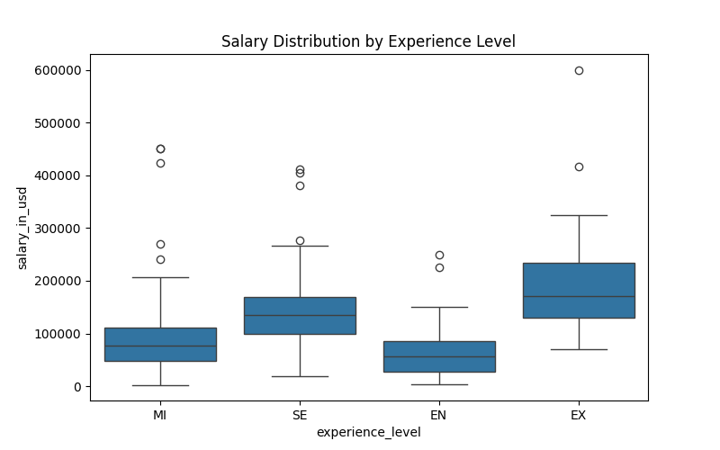
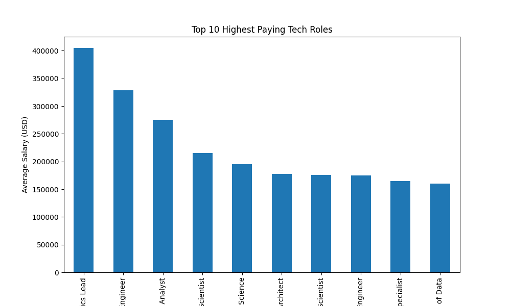
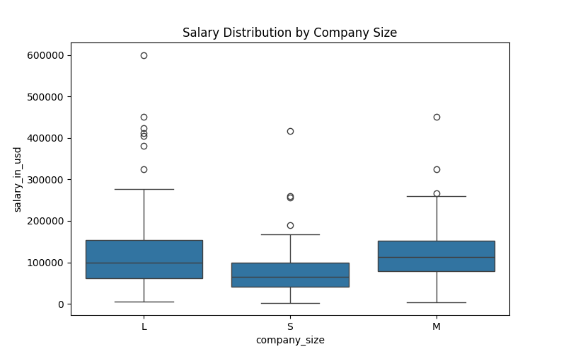
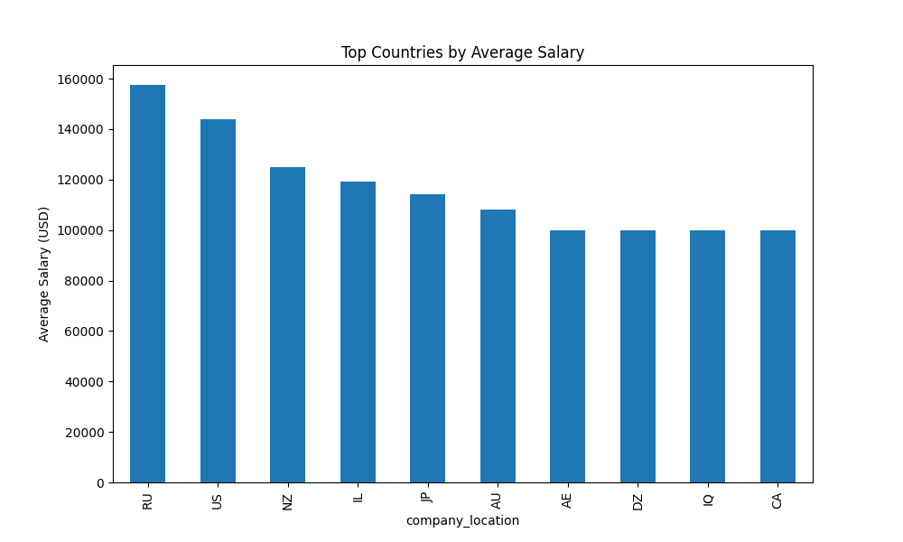

# Tech Job Market Salary Analysis

Data analysis project exploring global salary trends in data science and technology roles using Python and visualization techniques.

---

## Overview

This project analyzes worldwide technology job salary data to identify compensation patterns across experience levels, job roles, company sizes, and geographic locations.

The goal is to uncover insights into how different factors influence salaries in the global tech job market.

---

## 🛠️ Tech Stack

- Python  
- Pandas — data cleaning and aggregation  
- NumPy — numerical operations  
- Matplotlib — data visualization  
- Seaborn — statistical visualization  
- Jupyter Notebook — exploratory data analysis  

---

## Dataset

- Source: Kaggle — Data Science Job Salaries Dataset  
- Contains information such as:
  - Job title  
  - Experience level  
  - Company size  
  - Company location  
  - Salary in USD  

Dataset can be downloaded from:  
https://www.kaggle.com/datasets/ruchi798/data-science-job-salaries

Place the dataset inside the `data/` directory.

---

## Project Structure

- `data/` → raw dataset  
- `notebooks/` → analysis notebook  
- `images/` → generated visualizations  
- `requirements.txt` → project dependencies  
- `.gitignore` → ignored files  

---

## Methodology

- Data cleaning and preprocessing using Pandas  
- Salary normalization and grouping  
- Aggregation by job role, experience level, and company size  
- Geographic salary comparison  
- Visualization of salary distributions and trends  

---

## Key Questions Explored

- How does salary vary by experience level?  
- Which tech roles have the highest average salaries?  
- How do salaries differ across company sizes?  
- Which countries offer the highest tech compensation?  

---

## Results & Insights

- Senior-level roles consistently earn significantly higher salaries than entry-level positions.  
- Larger companies generally offer higher compensation compared to small and medium-sized firms.  
- Data science and machine learning roles appear frequently among the highest-paying positions.  
- Salary distributions vary widely across geographic regions due to economic and market differences.  

---

## 📊 Visualizations

### Salary by Experience Level



---

### Top Paying Job Roles



---

### Salary by Company Size



---

### Top Countries by Salary



---

## Run Instructions

```bash
git clone https://github.com/Ironclad1738281/tech-job-market-analysis.git
cd tech-job-market-analysis
pip install -r requirements.txt
jupyter notebook
Open:

`notebooks/analysis.ipynb`

---

## Future Improvements

- Add interactive dashboard (Plotly / Streamlit)  
- Build salary prediction model  
- Incorporate additional datasets for deeper market analysis  
- Perform time-series salary trend analysis  

---

## Author

**Naveenchandra Nallamothu**  
B.S. Computer Science — George Mason University